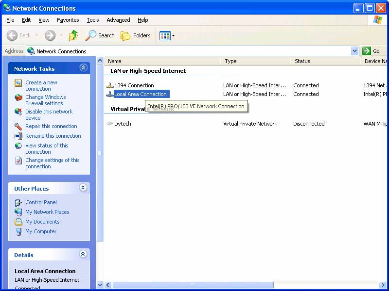
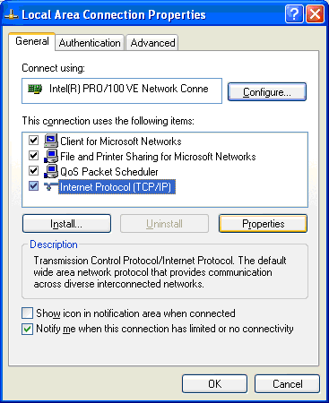
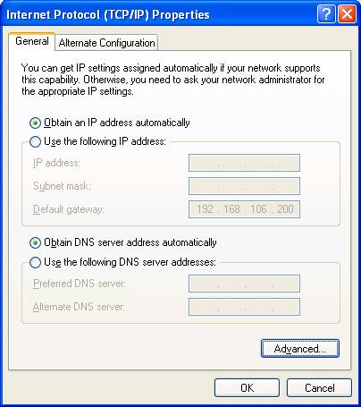
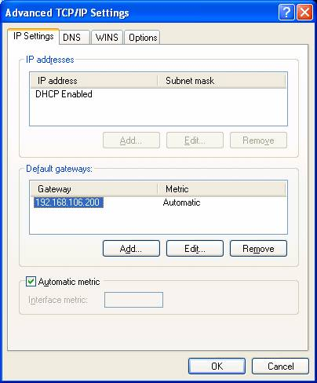
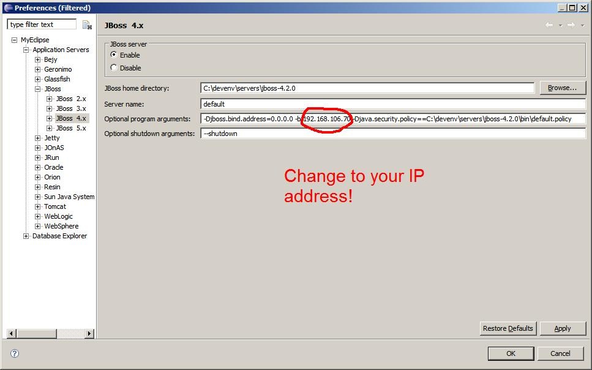

# Guide to getting the dev environment running

## Prerequisites

You will need

  - The Dytech Standard Java Development Environment (devenv) installed.
    Please see \[kb:Java Development Environment\].
  - Java installed and configured - developers will have this from
    devenv. Please ensure you are using version Hotspot 1.5.0.11. (just
    type java -version on the command line)
  - Ant installed and configured - developers will have this from
    devenv. Please ensure you are using version 1.6.5. (just type java
    -version on the command line)  
    You should have a copy in \\devenv\\util\\apache-ant-xxx. Set the
    following environment variables (Add new under User Variables, or
    append existing in either User Variables or System Variables - note
    that if variables are duplicated the user variables have preference)

<table>
<colgroup>
<col style="width: 50%" />
<col style="width: 50%" />
</colgroup>
<thead>
<tr class="header">
<th><p>Variable</p></th>
<th><p>Value</p></th>
</tr>
</thead>
<tbody>
<tr class="odd">
<td><p>PATH</p></td>
<td><p>Put <strong>;c:\devenv\util\apache-ant-1.6.5\bin</strong> at the end (if its not already there)</p></td>
</tr>
<tr class="even">
<td><p>ORACLE_HOME</p></td>
<td><p><strong>C:\devenv\util\oracletools</strong> change or add this target</p></td>
</tr>
<tr class="odd">
<td><p>PATH</p></td>
<td><p><strong>;C:\devenv\util\oracletools\bin</strong> add this at the end</p></td>
</tr>
<tr class="even">
<td><p>ANT_HOME</p></td>
<td><p><strong>c:\devenv\util\apache-ant-1.6.5</strong></p></td>
</tr>
<tr class="odd">
<td><p>ANT_OPTS</p></td>
<td><p><strong>-XX:MaxPermSize=512m -Xmx512m</strong></p></td>
</tr>
<tr class="even">
<td><p>JBOSS_HOME</p></td>
<td><p>add this variable and set to Jboss folder.<br />
<strong>e.g.  C:\devenv\servers\jboss-4.2.0</strong></p></td>
</tr>
</tbody>
</table>

  - Eclipse installed and configured - developers will have this from
    devenv
  - TortoiseSVN installed (http://tortoisesvn.tigris.org)

### Sqlplus

Sqlplus is the commandline client for oracle databases. To set it up:  
1\. You should already have the binaries on your computer at
c:\\devenv\\util\\oracletools  
2\. If an environment variable does not exist for ORACLE\_HOME set it to
the oracletools folder (no trailing slash)  
3\. If your PATH environment variable does not include
%ORACLE\_HOME%/bin be sure to append it onto the end (remember ;
separators)

  - Note that changed environment variables are not available to running
    processes. Applications that need to will need to be restarted.  
    (ie close your console window and open it again)

Open up the **tnsnames.ora** file found at
**C:\\devenv\\util\\oracletools\\network\\admin** and add these two
lines at the end of the file:

<div class="code panel pdl" style="border-width: 1px;">

<div class="codeContent panelContent pdl">

``` java
MRS =   (DESCRIPTION = (ADDRESS = (PROTOCOL = TCP)(HOST = pemsdb.olympus.dytech.com.au)(PORT = 1521)) (CONNECT_DATA = (SERVER = DEDICATED) (SERVICE_NAME = mrs ) ) )
MRSTEST =   (DESCRIPTION = (ADDRESS = (PROTOCOL = TCP)(HOST = tmrd-db)(PORT = 1521)) (CONNECT_DATA = (SERVER = DEDICATED) (SERVICE_NAME = tmrd ) ) )
```

</div>

</div>

## Setup your network settings

The development server (smithers) is on a separate subnet so you will
need to make some network changes in order to access it and other
resources which are located within the DIER network.

  - Open your network settings - you can find it under control panels.



  - Right click on Local Area Connection and select properties.



  - Click on Internet Protocol and then Properties



  - Click on the advanced button:



  - Click on Add and enter in 192.168.106.200 as the default gateway
  - Click on OK and exit out
  - Open a command window and type the following:

<div class="code panel pdl" style="border-width: 1px;">

<div class="codeContent panelContent pdl">

``` java
route add -p 147.109.34.3 mask 255.255.255.255 192.168.106.250
route add -p 192.168.107.0 mask 255.255.255.0 192.168.106.250
```

</div>

</div>

## JBoss Settings

Configure jboss to use the following settings. Make sure that you set
the -b address parameter to the IP address of your machine and **not**
the IP address shown. The default.policy can be downloaded from the
attachments section of this page and is only necessary for working with
ESB/mule related adaptations.  
  

### Overridable settings

If you set -Dinterfaces.url in your jboss environment to your (forward
slashed) interfaces directory you can use a UNIX-configured database  
example: -Dinterfaces.url=C:/svn/mrs/trunk/actrego/interfaces

You can use this interfaces.url to compress other references in your
path

## Checkout the Source

1.  Create a c:\\svn folder and navigate to it
2.  Right click anywhere in the folder and choose *svn checkout*
3.  Set the url of the repository to **svn://svn/mrs/trunk**
4.  Hit ok and wait while the source is checked out (about 10 min)

## Configure the Build

These steps are repeatable.  
You configure the build each time you want to change what you are
deploying.

1.  Open a console window and navigate to **\\svn\\mrs\\trunk\\actrego**
2.  type **ant bootstrap**  
    This will delete your environment.properties, and your
    configuration/\<machinename\> folder, and recreate them again.  
    This will also call the **generate** task which will compile the
    source, and generate the required configuration files into the
    source path
3.  Refresh each of your eclipse projects  
    If you forget this, eclipse will not 'see' the files changed and
    will not redeploy the settings files etc to the deployment
    destination
4.  change to the mrsejb dir
5.  type **ant javadoc** (you will need to do this occasionally to
    ensure your docs are up to date)

## Import the Source into Eclipse

1.  Start eclipse.
2.  From the file menu choose import (or rightclick in the package
    explorer and choose import)
3.  Select **existing projects into workspace**
4.  Set the project root directory to **c:\\svn\\mrs\\trunk** (or
    whereever the source is checked out to)
5.  Click the big white box (text field needs to lose focus)
6.  Make sure the (three) boxes are checked
7.  Make sure that the 'copy to workspace' is **unchecked**
8.  Hit finish
9.  On MRSEJB right click properties
10. Go to Java Compiler
11. Uncheck use Workspace specific settings
12. Click on installed JREs
13. Click on Add - located the 1.5.0.11 jdk (under devenv/sdk)
14. Make that the default
15. Go to Java Build Path
16. Remove the JRE library
17. Add the JRE System Library (click on Libraries)
18. Right click on the MRS project and goto properties
19. Go to the MyEclipse-\>Ear menu
20. On the 'library deployment policies' panel
    1.  Uncheck the 'use workbench default settings'
    2.  Check the export jars from dependent projects item
    3.  Select the 'Do not modifdy 'Application.xml'
    4.  Select OK  
        These settings should be set as in the following diagram.  
          Unable to render embedded object: File (container.jpg) not
        found.
21. Configure the canoo-libraries
    1.  From the eclipse window, Window-\>Prefrences
    2.  Go to Java-\>BuildPath-\>Classpath Variables
    3.  Press New
    4.  Set the name to CANOO\_LIB
    5.  Set the path folder to your actrego/tools/canoo-(whatever
        version)/lib (from trunk, or whatever)
    6.  Save the variable and close the window
    7.  You should be able to run webtests from inside the dev
        environment
22. Configure the marathon-libraries
    1.  From the eclipse window, Window-\>Prefrences
    2.  Go to Java-\>BuildPath-\>Classpath Variables
    3.  Press New
    4.  Set the name to MARATHON\_LIB
    5.  Set the pathname folder to /actrego/tools/marathon (from trunk,
        or whatever)
    6.  Save the variable and close the window
    7.  Right click on MRSEJB and goto Properties-\>Libraries
    8.  Click Add Variable
    9.  Click once on MARATHON\_LIB, then click Extend
    10. Select the following jars: (all jars two levels down, except
        junit, ignoring .svn folders)
          - marathon.jar
          - Support\\forms-1.0.7\\forms-1.0.7.jar
          - Support\\jaccess-1.3\\jaccess.jar
          - Support\\jython-2.1\\jython.jar
          - Support\\looks-2.0.4\\rmi-lite.jar
          - Support\\looks-2.0.4\\vldocking\_2.1.1.jar
    11. Click ok
23. Press the deploy button from the toolbar
24. Choose MRS as the project
25. Select jboss as the server from the menu
26. Follow the following steps if you dont have jboss
    1.  Click the **edit server connectors** link
    2.  Select the **Jboss 4** menu item
    3.  Enable the server
    4.  You can make any of the other servers disabled if you don't want
        them on the deployment menu
27. Choose exploded deployment
28. You will probably have to wait until eclipse builds and deploys the
    whole application
29. Hit finish
30. Right click on the mrsejb project, choose properties
31. Go to the 'javadoc location' menu item
32. Type \*\[file:/c:/svn/mrs/trunk/actrego/mrsejb/javadoc\*\] into the
    location (dont worry if it isn't here yet)
33. Remove all the jars from the MRSEJB project build path and wait for
    the rebuild (Select all the JARS except JRE system library and click
    remove)
34. Add all the jars back into the MRSEJB project and wait for the
    rebuild (Select 'Add Jars...' button and select all the JARS in the
    lib directories)
35. Right click on the MRSEJB Project -\> Open the project properties
36. Mark all the jars as exported (Project Properties for MRSEJB -\>
    Build Path -\> Export tab and select all the jars as exported)
37. Go to Windows/Preferences/MyEclipse/Files & Editors/XML/XML Catalog
38. Enter in a User Specified Entry with the details:
    1.  URI: platform:/resource/MRSEJB/index\_1\_0.dtd
    2.  Key Type: URI
    3.  Key: http://java.sun.com/products/javahelp/index\_1\_0.dtd
39. Enter in a User Specified Entry with the details:
    1.  URI: platform:/resource/MRSEJB/toc\_1\_0.dtd
    2.  Key Type: URI
    3.  Key: http://java.sun.com/products/javahelp/toc\_1\_0.dtd

### Troubleshoot

If you get the error, 'No project modules assigned', do the following:

1.  Right click on MRS project and select My Eclipse -\> Add remove
    modules
2.  Add MRSEJB and MRSWeb projects

If you get an error like 'Could not read project metadata', do the
following:

1.  Close the MRS project
2.  Reopen the MRS project

## Setup of external dependencies

Note that this is not required on a development machine.

### Building with Ant (for Hudson only)

Each time you will need to do the following.

1.  Open a console window and navigate to
    **\\svn\\mrs\\trunk\\actrego\\MRSDeployment**
2.  type **ant generate-web, generate-webstart or generate-all** to
    build the required jars and ear. generate-web will war the web pages
    available. If you enter generate-webstart will war the spring gui
    client.
3.  run **ant deploy** to deploy your generated ear to the jboss deploy
    folder - *note if you are having problems with your eclipse jboss
    deployment make sure you haven't deployed mrs.web.ear to the same
    jboss directory by mistake using the these build script options.*
4.  run **ant start-jboss** to start the server (Note: if JBoss fails to
    start for any reason, you WILL need to kill the process with the
    task manager or process explorer. Running "ant stop-jboss" will not
    work)
5.  to stop the server do **ctrl-c** to get the console back then run
    **ant stop-jboss**. If you do not run stop-jboss then the server
    keeps running in the background.

Running

  - If you ran **generate-web** or **generate-all** then goto the
    address: http://localhost:8080/mrs/regoact to see the login page for
    the web page.
  - If you ran **generate-webstart** or **generate-all** then run the
    jnlp at the address: http://localhost:8080/mrsclient/mrs.jnlp - This
    will launch webstart and download the client war presenting you with
    the login screen.

All going well you should be able to log in and run the app.

<div class="pageSectionHeader">

## Attachments:

</div>

<div class="greybox" data-align="left">


[default.policy](attachments/327835/327836.policy)
(application/octet-stream)  

[jboss.jpg](attachments/327835/327842.jpg) (image/jpeg)  

[net1.bmp](attachments/327835/327843.bmp) (image/bmp)  

[net2.bmp](attachments/327835/327844.bmp) (image/bmp)  

[net3.bmp](attachments/327835/327845.bmp) (image/bmp)  

[net4.bmp](attachments/327835/327846.bmp) (image/bmp)  

</div>
